  

**AI Delivery Lead • Enterprise Architect • Engineering Leader**

I help organizations turn ambitious ideas into production-ready AI platforms, digital products, and scalable engineering organizations — with 20+ years across fintech, banking, and enterprise technology in the UAE and Azerbaijan.

## Highlights

* **Career** — 20+ years in fintech & banking across ING, eBay, Commercial Bank of Dubai, and International Bank of Azerbaijan (13+ organizations).
* **AI today** — Production AI systems for regulated industries: RAG pipelines, multi-agent orchestration, LLMOps, and real-time fraud scoring on Azure OpenAI + Anthropic.
* **Leadership** — Cross-functional teams of 8–12 engineers; 100% on-time delivery across 12 major releases; release cycles cut from 2 weeks to 2 days; PCI DSS compliance.
* **Credentials** — IBM & Anthropic AI certifications, 5 books, 28 certifications, 38 AI projects shipped. B.Sc. Electronics & Communication Engineering. English (C2), German (B1).

---

## What I Do

**AI Strategy & Delivery** — Enterprise AI transformation · GenAI platforms · RAG & knowledge systems · AI agents · governance & responsible AI · production AI operations

**Architecture & Engineering** — Cloud-native architecture · distributed systems · API platforms · platform engineering · mobile engineering · DevOps & MLOps

**Leadership** — Building high-performing teams · engineering coaching · delivery governance · technology strategy · product execution

---

## Technology Stack

### Programming Languages

### AI & Machine Learning

### Cloud & Infrastructure

### Backend Engineering

### Mobile Development

### DevOps & CI/CD

---

## Open Source

### [twitter-bootstrap-rails](https://github.com/seyhunak/twitter-bootstrap-rails)

Maintainer and contributor supporting the Ruby on Rails ecosystem.

Browse the rest of my work at [github.com/seyhunak](https://github.com/seyhunak).

---

## Writing & Publications

I write about AI, engineering leadership, software architecture, product development, fintech innovation, and the future of work — on [Medium](https://medium.com/@seyhunak), [Substack](https://seyhunak.substack.com/), and [Dev.to](https://dev.to/seyhunak).

---

## Latest Articles

<!-- ARTICLES START -->
- [Making Any Website Agent-Ready with WebMCP](https://medium.com/@seyhunak/making-any-websiteagent-ready-with-webmcp-5569adc81845?source=rss-192c1ebd2112------2)
- [Production Multi-Agent Systems: Architecture Patterns for Enterprise AI](https://medium.com/@seyhunak/production-multi-agent-systems-architecture-patterns-for-enterprise-ai-e3ab8af62a83?source=rss-192c1ebd2112------2)
- [AI Governance in Banking: The Playbook for Safe, Compliant, and Defensible AI](https://medium.com/@seyhunak/ai-governance-in-banking-the-playbook-for-safe-compliant-and-defensible-ai-e5c5dc6c3279?source=rss-192c1ebd2112------2)
- [LLM-as-a-Judge: The Complete Guide to Using AI to Evaluate AI](https://medium.com/@seyhunak/llm-as-a-judge-the-complete-guide-to-using-ai-to-evaluate-ai-1f21448c8942?source=rss-192c1ebd2112------2)
- [The Real Cost of Running LLMs in Production: A Complete Breakdown](https://medium.com/@seyhunak/the-real-cost-of-running-llms-in-production-a-complete-breakdown-982c80304a10?source=rss-192c1ebd2112------2)
<!-- ARTICLES END -->

Updated daily from my Medium and Substack feeds.