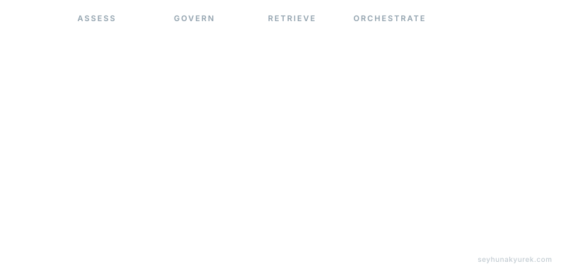

  

**AI Delivery Lead • Enterprise Architect • Engineering Leader**

  

I help organizations turn ambitious ideas into production-ready AI platforms, digital products, and scalable engineering organizations — with 20+ years across fintech, banking, and enterprise technology in the UAE and Azerbaijan.

## Currently

* 🔭 Building production AI systems — RAG, agent orchestration, and LLMOps for regulated industries.
* 🛠️ Maintaining [twitter-bootstrap-rails](https://github.com/seyhunak/twitter-bootstrap-rails) — **4.4k stars, 973 forks**, shipped through Bootstrap 2 → 5.
* ✍️ Writing on AI, architecture, and engineering leadership — [Substack](https://seyhunak.substack.com/) and [Dev.to](https://dev.to/seyhunak).
* 🎤 Available for speaking on enterprise AI and engineering leadership.
* 🤝 Open to collaboration on AI and open-source projects.

---

## Highlights

* **Career** — 20+ years in fintech & banking across ING, ABB, eBay, Commercial Bank of Dubai, and International Bank of Azerbaijan (13+ organizations).
* **Open source** — Maintainer of [twitter-bootstrap-rails](https://github.com/seyhunak/twitter-bootstrap-rails), one of the most-starred Ruby on Rails libraries (**4.4k stars, 973 forks**) with over a decade of continuous maintenance across major version generations.
* **AI today** — Production AI systems for regulated industries: **100+ agents** in production, plus RAG pipelines, multi-agent orchestration, LLMOps, and real-time fraud scoring on Azure OpenAI + Anthropic.
* **Published methods** — [ai-sdlc](https://github.com/seyhunak/ai-sdlc) (agentic SDLC) and [ai-delivery-playbook](https://github.com/seyhunak/ai-delivery-playbook) (enterprise AI delivery aligned to CBUAE and UAE PDPL).
* **Leadership** — Cross-functional teams of 8–12 engineers; 100% on-time delivery across 12 major releases; release cycles cut from 2 weeks to 2 days; PCI DSS compliance.
* **Credentials** — 28 certifications including IBM and Anthropic AI credentials, 5 books, 38 AI projects shipped. B.Sc. Electronics & Communication Engineering. English (C2), German (B1).

---

## What I Do

**AI Strategy & Delivery** — Enterprise AI transformation · GenAI platforms · RAG & knowledge systems · AI agents · governance & responsible AI · production AI operations

**Architecture & Engineering** — Cloud-native architecture · distributed systems · API platforms · platform engineering · mobile engineering · DevOps & MLOps

**Leadership** — Building high-performing teams · engineering coaching · delivery governance · technology strategy · product execution

---

## Technology Stack

### Programming Languages

### AI & Machine Learning

### Cloud & Infrastructure

### Backend Engineering

### Mobile Development

### DevOps & CI/CD

---

## Featured Projects

### [ai-sdlc](https://github.com/seyhunak/ai-sdlc)

**AI-Led SDLC** · agentic-ai · spec-driven-development

An AI-Led software development lifecycle reference — methodology, stack, toolkit, and skills for running an agentic SDLC. A synthesis of AWS AI-DLC, spec-driven governance, and Azure + GitHub agentic implementation.

### [ai-delivery-playbook](https://github.com/seyhunak/ai-delivery-playbook)

**AI Delivery Playbook** · regulated banking · CBUAE · UAE PDPL

The delivery counterpart to `ai-sdlc`: an enterprise playbook for delivering generative AI in regulated banking, aligned to **CBUAE** and **UAE PDPL** requirements. Centralizes governance, architecture, delivery, and operational-readiness documentation, with decision points traceable from use-case approval through release and monitoring.

### [twitter-bootstrap-rails](https://github.com/seyhunak/twitter-bootstrap-rails)

**4.4k stars · 973 forks** · Ruby on Rails

Bootstrap integration for Rails, maintained from Bootstrap 2 through Bootstrap 5 — currently at [v5.4.0](https://github.com/seyhunak/twitter-bootstrap-rails/releases/tag/v5.4.0) with full Rails 8 and Propshaft support. Over a decade of continuous releases by the maintainer, and one of the most widely used libraries in the Ruby on Rails ecosystem.

### [CraftedCode](https://github.com/seyhunak/craftedcode)

Native AI coding terminal. A framework for building production-grade AI agents, coding assistants, and automation workflows.

### [awesome-ai](https://github.com/seyhunak/awesome-ai)

A curated list of Enterprise AI, LLMs, GenAI, AI agents, MCP, governance, security, MLOps, and production-ready AI tools.

### [mnemosyne](https://github.com/seyhunak/mnemosyne)

**Local-first AI memory** · Python · Obsidian-native

Persistent memory for AI applications. Notes live as plain `.md` files on disk — readable by agents, editable in Obsidian, owned by you. Retrieval is BM25-ranked full-text search over a SQLite index that can be rebuilt and deleted at any time without losing a byte. No server, no embedding model, no vendor; one dependency.

---

## Curated Guides

Long-running reference lists I maintain across the domains I work in.

* **[awesome-banking](https://github.com/seyhunak/awesome-banking)** — the banking domain: products, payments, security, compliance, architecture, AI, low-code/no-code, and mobile design.
* **[awesome-bots](https://github.com/seyhunak/awesome-bots)** — a directory of AI bots: assistants, coding agents, web crawlers, and automation workflows.
* **[awesome-omarchy](https://github.com/seyhunak/awesome-omarchy)** — an opinionated guide to Omarchy: themes, plugins, dotfiles, hardware, and everything from ISO to ricing.
* **[awesome-job](https://github.com/seyhunak/awesome-job)** — the job market: portals, company career pages, remote boards, headhunters, interview prep, CV services, and salary intel across GCC/MENA/EU/US.

Browse the rest of my work at [github.com/seyhunak](https://github.com/seyhunak).

---

## Latest Releases

<!-- RELEASES START -->
- [v5.4.0](https://github.com/seyhunak/twitter-bootstrap-rails/releases/tag/v5.4.0) — 2026-08-02
- [1.0](https://github.com/seyhunak/craftedcode/releases/tag/1.0) — 2026-06-27
<!-- RELEASES END -->

---

## Speaking & Events

* **AI Delivery in Regulated Industries** — Enterprise AI architecture and governance for banking and fintech.
* **Production Multi-Agent Systems** — Architecture patterns for enterprise AI at scale.
* **Engineering Leadership** — Building and scaling high-performing distributed teams.

More talks and appearances on my [website](https://www.seyhunakyurek.com/).

---

## Books & Reading

* **AI at Work: Future-Proofing Your Career in the Age of Automation**
* **Modern Fintech & Banking Transformation: A Comprehensive Guide**
* **Invisible Colleagues: Redefining Work in the Age of AI**

Full list on [Substack](https://seyhunak.substack.com/) and [Dev.to](https://dev.to/seyhunak).

---

## Writing & Publications

I write about AI, engineering leadership, software architecture, product development, fintech innovation, and the future of work — on [Substack](https://seyhunak.substack.com/) and [Dev.to](https://dev.to/seyhunak).

---

## Latest Articles

<!-- ARTICLES START -->
- [Making Any Website Agent-Ready with WebMCP](https://seyhunak.substack.com/p/making-any-website-agent-ready-with)
- [Production Multi-Agent Systems: Architecture Patterns for Enterprise AI](https://seyhunak.substack.com/p/production-multi-agent-systems-architecture)
- [AI Governance in Banking: The Playbook for Safe, Compliant, and Defensible AI](https://seyhunak.substack.com/p/ai-governance-in-banking-the-playbook)
- [LLM-as-a-Judge: The Complete Guide to Using AI to Evaluate AI](https://seyhunak.substack.com/p/llm-as-a-judge-the-complete-guide)
- [The Real Cost of Running LLMs in Production: A Complete Breakdown](https://seyhunak.substack.com/p/the-real-cost-of-running-llms-in)
<!-- ARTICLES END -->

Updated daily from my Substack feed.

---

## Latest from Dev.to

<!-- DEVTO ARTICLES START -->
- [Book: AI at Work: Future-Proofing Your Career in the Age of Automation](https://dev.to/seyhunak/book-ai-at-work-future-proofing-your-career-in-the-age-of-automation-3pok)
- [Book: Modern Fintech & Banking Transformation: A Comprehensive Guide](https://dev.to/seyhunak/book-modern-fintech-banking-transformation-a-comprehensive-guide-3i6)
- [Book: Invisible Colleagues: Redefining Work in the Age of AI](https://dev.to/seyhunak/book-invisible-colleagues-redefining-work-in-the-age-of-ai-3k1i)
- [My Journey: Demystifying Core Software Engineering Concepts](https://dev.to/seyhunak/my-journey-demystifying-core-software-engineering-concepts-1hl7)
- [Crafted AI Framework](https://dev.to/seyhunak/crafted-ai-framework-502m)
<!-- DEVTO ARTICLES END -->

Updated daily from Dev.to.
